# 🚀 Tweetalytics - AI-Powered Tweet Optimization

<div align="center">


**Transform your ideas into viral tweets with AI scoring and optimization**

[](https://tweetalytics.vercel.app)
[](https://tweetalytics.vercel.app/setup)
[](https://github.com/sushiselite/auto-social/stargazers)

*No guesswork, no stress, just data-driven content creation*

</div>

---

## ✨ What is Tweetalytics?

Tweetalytics is an AI-powered social media optimization platform that transforms your raw ideas into viral-ready tweets. Simply speak your thoughts or type your ideas, and our AI will generate optimized content with viral scoring to maximize engagement.

## 🎯 Key Features

<table>
<tr>
<td width="50%">

### 🎤 **Voice to Tweet**
- Record your thoughts naturally
- AI transcription with OpenAI Whisper
- Instant tweet generation from speech

### 🤖 **AI Tweet Generation**
- Powered by Anthropic Claude
- Learns your unique writing style
- Generates multiple variations

</td>
<td width="50%">

### 📊 **Viral Scoring System**
- AI-powered engagement prediction
- Quality, authenticity & viral metrics
- Data-driven optimization

### 📈 **Smart Management**
- Kanban-style tweet workflow
- Performance tracking & analytics
- Automated scheduling capabilities

</td>
</tr>
</table>

## 🛠️ Technology Stack

- **Frontend**: Next.js 14 with App Router, TailwindCSS, TypeScript
- **Backend**: Supabase (Auth, Database, Real-time)
- **AI**: Anthropic Claude (content generation), OpenAI Whisper (transcription)
- **Deployment**: Vercel with automatic deployments

## 📁 Project Structure

```
auto-social/
├── app/                    # Next.js App Router pages
├── components/             # Reusable React components
├── lib/                    # Utility functions and services
├── database/               # Database setup and migrations
│   ├── migrations/         # SQL schema files
│   └── triggers/           # Database triggers
├── docs/                   # Project documentation
│   └── project/            # Technical documentation
└── README.md              # This file
```

**For Developers**: See our complete [technical documentation](./docs/project/CODEBASE_OVERVIEW.md) for detailed architecture info.

## 🚀 Quick Start

### 1️⃣ **Try the Live Demo**
Visit [**tweetalytics.vercel.app**](https://tweetalytics.vercel.app) to see it in action!

### 2️⃣ **Set Up Your Own Instance**
Follow our comprehensive setup guide for a complete walkthrough:

<div align="center">

[](https://tweetalytics.vercel.app/setup)

</div>

The setup guide includes:
- 📦 Repository cloning and installation
- 🗃️ Supabase database configuration
- 🔑 API key setup (Anthropic, OpenAI)
- 🐦 Optional Twitter integration
- 🎨 Environment configuration

## 📊 Current Status

### ✅ **Production Ready**
The application is fully functional with real AI integration and smart fallback system.

**Core Features Working:**
- ✅ Complete authentication system with Supabase
- ✅ Real-time kanban tweet management with database persistence
- ✅ Voice recording and OpenAI Whisper transcription
- ✅ AI tweet generation with Anthropic Claude API
- ✅ Training system for personalized AI responses
- ✅ Analytics dashboard with performance tracking
- ✅ Responsive design with modern UI/UX
- ✅ Smart API status monitoring with fallbacks

**Smart Demo Mode**: The app automatically detects missing API keys and gracefully falls back to demo functionality while clearly indicating status to users. Perfect for development and testing!

## 🎨 Screenshots

<div align="center">
<table>
<tr>
<td><strong>🏠 Landing Page</strong></td>
<td><strong>📱 Dashboard</strong></td>
</tr>
<tr>
<td></td>
<td></td>
</tr>
</table>
</div>

## 🎯 How It Works

```mermaid
graph LR
    A[💭 Idea] --> B[🎤 Voice/Text Input]
    B --> C[🤖 AI Processing]
    C --> D[📊 Viral Scoring]
    D --> E[✨ Optimized Tweet]
    E --> F[📈 Performance Tracking]
```



1. **Capture Ideas**: Record voice memos or type your thoughts
2. **AI Processing**: Claude AI generates multiple tweet variations
3. **Viral Scoring**: AI analyzes and scores potential engagement
4. **Optimization**: Choose the best version or refine further
5. **Track Performance**: Monitor engagement and improve over time

## 🤝 Contributing

We welcome contributions! Please see our contributing guidelines:

1. Fork the repository
2. Create a feature branch: `git checkout -b feature/amazing-feature`
3. Commit changes: `git commit -m 'Add amazing feature'`
4. Push to branch: `git push origin feature/amazing-feature`
5. Open a Pull Request

## 📄 License

This project is licensed under the MIT License - see the [LICENSE](LICENSE) file for details.

## 🆘 Support & Community

- **🐛 Found a bug?** [Open an issue](https://github.com/sushiselite/auto-social/issues)
- **💡 Have an idea?** [Start a discussion](https://github.com/sushiselite/auto-social/discussions)
- **📚 Need help?** Check our [setup guide](https://tweetalytics.vercel.app/setup)

## 🔮 Roadmap

- [ ] **Direct Twitter Integration**: Post directly to Twitter
- [ ] **Multi-Platform Support**: LinkedIn, Facebook, Instagram
- [ ] **Advanced Analytics**: Detailed engagement insights
- [ ] **Team Collaboration**: Multi-user workspaces
- [ ] **A/B Testing**: Test tweet variations
- [ ] **Mobile App**: Native iOS/Android apps
- [ ] **API Access**: Developer API for integrations

---

<div align="center">

**Built with ❤️ to democratize social media management**

[⭐ Star this repo](https://github.com/sushiselite/auto-social/stargazers) • [🚀 Try Live Demo](https://tweetalytics.vercel.app) • [📖 Setup Guide](https://tweetalytics.vercel.app/setup)

</div> 